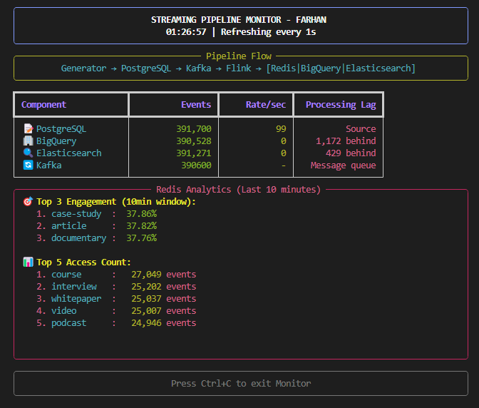

# Distributed Stream Processing Pipeline

A streaming data pipeline built with **Kafka**, **Debezium**, and **Flink** for real-time multi-sink fan-out processing.

## Architecture

```
PostgreSQL → Debezium → Kafka → Flink → [Redis | BigQuery | Elasticsearch]
     ↓           ↓        ↓       ↓           ↓        ↓           ↓
  Source DB   CDC Tool  Stream  Processing  Analytics Storage   Search
```

The pipeline captures engagement events from PostgreSQL using Change Data Capture (CDC), processes them through Flink for enrichment and transformation, then fans out to multiple sinks for different use cases.

## Project Structure

```
stream-processing-project/
├── postgresql/          # Source database with CDC enabled
├── generator/           # Python data generator 
├── kafka/              # Kafka connector configuration
├── flink-scala/        # Flink processing job (Scala)
├── debezium/           # CDC connector config
├── bigquery/           # BigQuery emulator setup
├── elasticsearch/      # Elasticsearch configuration
├── docker-compose.yml  # All services orchestration
├── run.sh             # One-click startup script
├── monitor.py         # Real-time pipeline monitor
├── stress_test.py     # Load testing tool
└── requirements.txt   # Python dependencies
```

## Quick Start

### Prerequisites
- Docker & Docker Compose
- Python 3.12+

### Run Everything
```bash
chmod +x run.sh
./run.sh start
```

The `run.sh` script will:
1. Start all Docker services automatically
2. Initialize databases and connectors
3. Set up the Flink processing job
4. Install Python dependencies
5. Launch the real-time monitor



## Real-Time Monitoring

The monitor shows:
- **Event counts** across all sinks
- **Processing rates** (events/second)
- **Pipeline lag** detection
- **Top content** by engagement (Redis analytics)
- **Error tracking** for all components

## Load Testing

Open a second terminal and run the stress test:

```bash
python3 stress_test.py
```

Customize load patterns by modifying:

```python
STRESS_STAGES = [
    {"name": "Baseline", "interval": 1.0, "batch_size": 100},      
    {"name": "Low Load", "interval": 0.5, "batch_size": 500},       
    {"name": "Medium Load", "interval": 0.2, "batch_size": 500}, 
    {"name": "High Load", "interval": 0.1, "batch_size": 500},   
    {"name": "Extreme Load", "interval": 0.05, "batch_size": 500},
]

STAGE_DURATION = 15  # seconds per stage
```

## Pipeline Components

- **PostgreSQL**: Source database with engagement events
- **Debezium**: Change Data Capture for real-time streaming
- **Kafka**: Message broker for reliable event streaming
- **Flink**: Stream processing engine for enrichment and fan-out
- **Redis**: Real-time analytics and caching
- **BigQuery Emulator**: Data warehouse for analytical queries
- **Elasticsearch**: Search and indexing engine

## Troubleshooting

If BigQuery emulator crashes (common under high load):
```bash
./run.sh clean
./run.sh start
```

## Configuration

The pipeline is fully configurable via the `.env` file. Key settings you can adjust:

**Performance Tuning:**
```bash
# Flink Performance
FLINK_PARALLELISM=12
CHECKPOINT_INTERVAL_MS=30000
KAFKA_SOURCE_PARALLELISM=4
PROCESSING_PARALLELISM=8

# Sink Performance  
REDIS_SINK_PARALLELISM=6
BIGQUERY_SINK_PARALLELISM=3
ELASTICSEARCH_SINK_PARALLELISM=4
```

**Batch & Flush Settings:**
```bash
# Redis (fastest updates)
REDIS_BATCH_SIZE=500
REDIS_FLUSH_INTERVAL_MS=500

# BigQuery (medium speed)
BIGQUERY_BATCH_SIZE=1000
BIGQUERY_FLUSH_INTERVAL_MS=5000

# Elasticsearch (medium speed)
ELASTICSEARCH_BATCH_SIZE=1000
ELASTICSEARCH_FLUSH_INTERVAL_MS=5000
```

**Data Generation:**
```bash
EVENT_INTERVAL_SECONDS=1    # How often to generate events
BATCH_SIZE=50              # Events per batch
CONTENT_ROWS=5000          # Total content items
```

After changing `.env` values, restart the pipeline:
```bash
./run.sh restart
```

## Other Commands

```bash
./run.sh stop          # Stop all services
./run.sh restart       # Restart pipeline
./run.sh logs          # View logs
./run.sh test          # Check service health
./run.sh clean         # Remove all data and restart fresh
```

## Key Features

- **Exactly-once processing** with Flink checkpointing
- **Sub-second latency** for Redis updates
- **Multi-sink fan-out** with independent scaling
- **Real-time analytics** with 10-minute sliding windows
